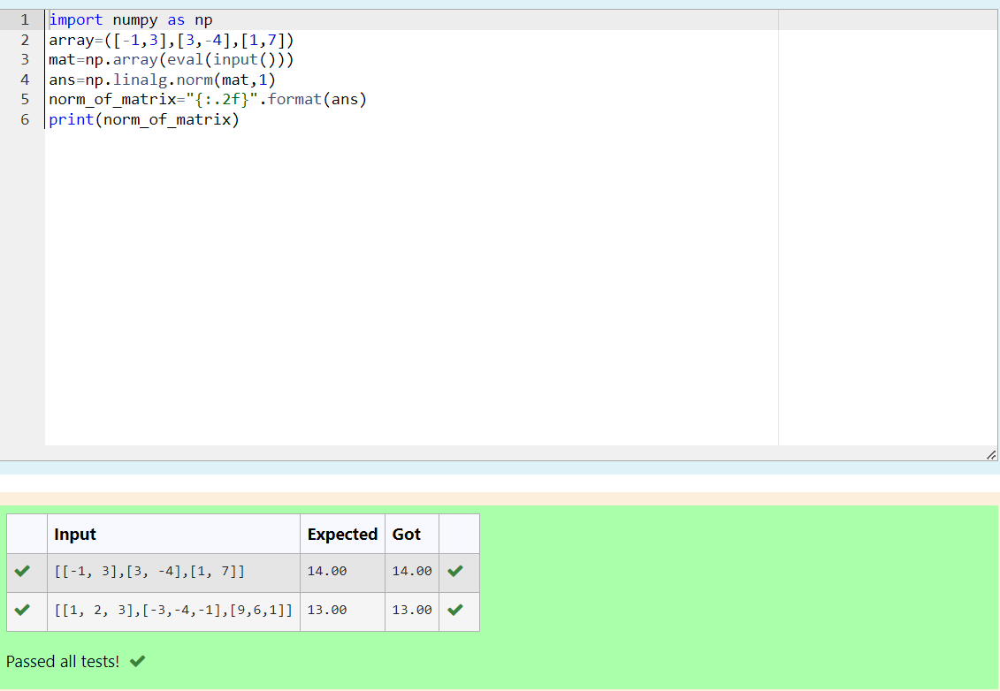

# Norm of a matrix
## Aim
To write a program to find the 1-norm, 2-norm and infinity norm of the matrix and display the result in two decimal places.
## Equipment’s required:
1.	Hardware – PCs
2.	Anaconda – Python 3.7 Installation / Moodle-Code Runner
## Algorithm:
	1. Get the input matrix using np.array()   
    2. Find the 2-norm of the matrix using np.linalg.norm()
	3. Print the norm of the matrix in two decimal places.
## Program:
```Python
# Register No:23013412
# Developed By:Shaik Samreen
# 1-Norm of a Matrix
```
import numpy as np
array=([-1,3],[3,-4],[1,7])
mat=np.array(eval(input()))
ans=np.linalg.norm(mat,1)
norm_of_matrix="{:.2f}".format(ans) 
print(norm_of_matrix)

```

# 2-Norm of a Matrix
```
'''
Program to find 2-norm of a matrix.
Developed by: shaik samreen
RegisterNumber: 23013412
'''
import numpy as np
array1=([[1,2],[3,4]])
array2=([[-1,3],[3,-4],[1,7]])
mat=np.array(eval(input()))
ans=np.linalg.norm(mat,2)
norm="{:.2f}".format(ans)
print(norm)
```

# Infinity Norm of a Matrix

```
import numpy as np
array1=([-1,3],[3,-4],[1,7])
mat=np.array(eval(input()))
ans=np.linalg.norm(mat,np.inf)
norm="{:.2f}".format(ans)
print(norm)

```
```
## Output:
### 1-Norm of a Matrix


### 2-Norm of a Matrix


### Infinity Norm of a Matrix


## Result
Thus the program for 1-norm, 2-norm and Infinity norm of a matrix are written and verified.
